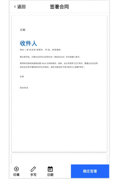

# javascript电子签名应用开发思路

## 运行
    客户端
    cd front-end
    yarn
    yarn start

    服务端
    cd server
    yarn
    yarn nodemon

## 预览

## 文档地址

[掘金：javascript电子签名应用开发思路](https://juejin.cn/post/7042515283419856910)